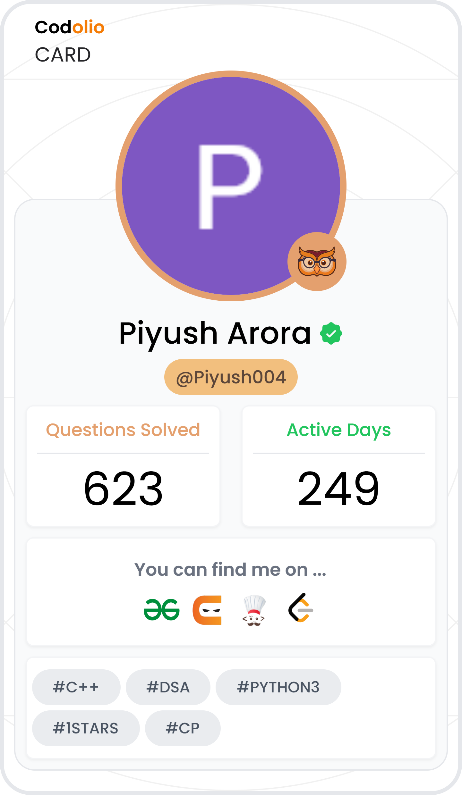

# Hey there! I'm Piyush Arora

I'm a third-year B.Tech student at IIIT Una, currently diving deep into full-stack development and machine learning.  
I enjoy building real-time systems, solving challenging problems, and working on ideas that have real-world impact.  
Whether it's coding a live collaboration platform or experimenting with LLMs — I'm always excited to build something meaningful.

---

## 💻 Tech I Use & Love

**Languages:**  

 
 
  

**Web & Backend:**  

 
  
  
  
  
  

**Databases & Tools:**  

  
  
  

**Others:**  

  
  
  

---

## 🚀 Some Projects I'm Proud Of

### 🔹 [CodeCollab](https://github.com/Piyusharora04/CodeCollab)  
A real-time code collaboration platform — like Google Docs but for code.  
Supports multiple languages, live video calls, and real-time sync.  
Tech: React, WebSockets, Docker, FastAPI, MongoDB  

---

### 🔹 [YouTube Summarizer + Comment Sentiment Analyzer](https://github.com/Piyusharora04/YT-Video-summarizer-and-Comment-Analyzer)  
An app that summarizes YouTube videos and tells you what viewers think about it.  
Tech: LLMs, Streamlit, YouTube API, NLP  

---

### 🔹 [PDF Summarizer + QA Tool](https://github.com/Piyusharora04/PDF-Query-Indexing-and-Summarizer)  
Upload your PDF, ask questions, get instant answers and summaries.  
Built using RAG pipelines and transformer-based models.  
Tech: Streamlit, LaMini-T5, ChromaDB  

---

## 🏆 Achievements

- Vice President of ASTRAL Club at IIIT Una  
- Solved 600+ DSA problems across LeetCode, GFG, and CodeChef  
- Qualified for Flipkart Grid 6.0 – Robotics (Round 2)  
- Past member of AAVESH Club (Tech & Research)

---

## 📊 GitHub Stats

  
  

---

## 📊 Codolio Stats

  

---

## 🤝 Let’s Connect

- 📬 Email: [arorapiyush991@gmail.com](mailto:arorapiyush991@gmail.com)  
- 💼 LinkedIn: [linkedin.com/in/piyush-arora-363a59265](https://www.linkedin.com/in/piyush-arora-363a59265)  
- 🌐 Codolio: [codolio.com/profile/Piyush004](https://codolio.com/profile/Piyush004)

Thanks for stopping by! Feel free to check out my projects or shoot me a message :)
